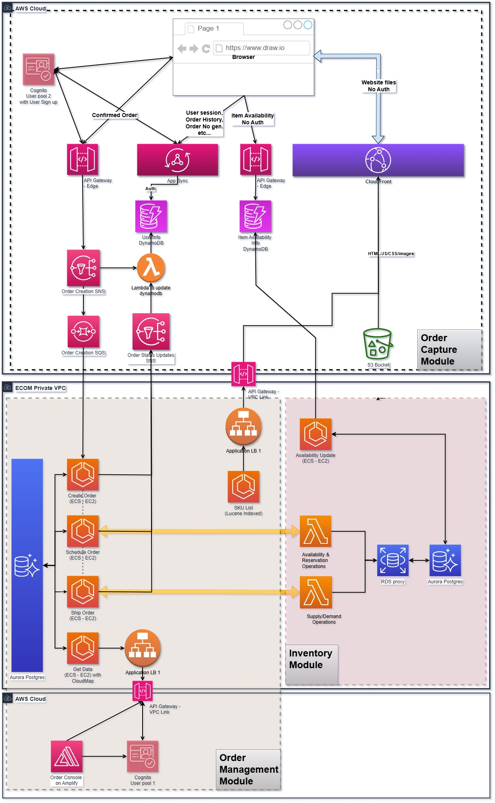
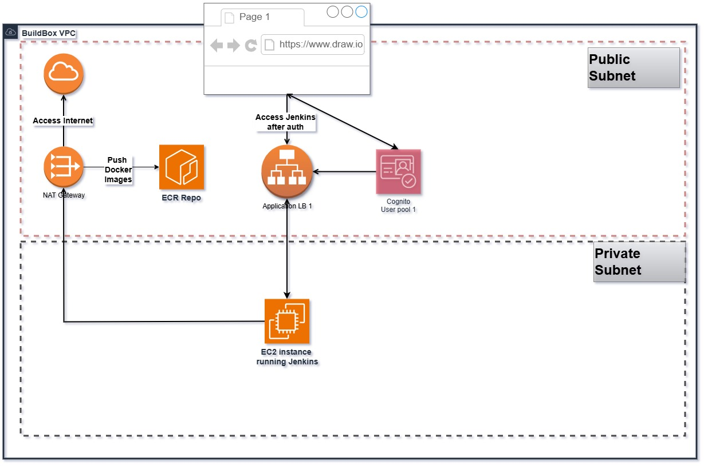

This is an e-commerce project hosted on AWS. 
To get started run the below commands from cloudshell.

```
git clone https://github.com/EVikramss/ECOM.git
chmod -R +x ECOM
cd ECOM
nohup ./setupBuildEnv.sh &
tail -f nohup.out
```
Note: Please check the cost before running this project. A rough estimate is given in docs/costEstimate along with the User guide.

This project is completely automated using Jenkins build for CI/CD. Architecture for the application & build systems is shown below.



----------------------------
Build system Architecture


